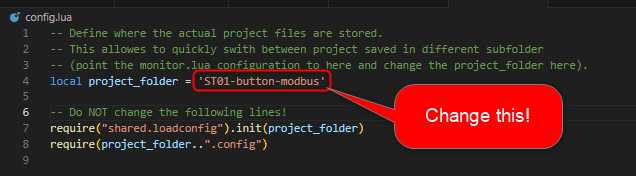

# Sample he-007

This demo project shows different ways on how to connect OGS with external I/O.

All documentation (including this file) is formatted in Markdown text. To better read these (*.md)
files, either see them online (at [https://github.com/haller-erne/ogs-samples](https://github.com/haller-erne/ogs-samples)) or use a decent text editor with Markdown support (e.g. the free [Visual Studio Code Editor](https://code.visualstudio.com/Download)).

## Overview

This folder provides a number of different samples (configured for the same workflows), which
show different options to connect external I/O and use it for different purposes.
To run a specific sample, edit the top-level `config.lua` file (in this folder) and change the project_folder variable to point to the sample subdirectory:

**Please note**: All samples use the same basic configuration and workflows. The **main difference** is the `station_io.lua` file and some related settings in `station.ini`. All sample code is in there (except
otherwise noted) - feel free to checkout how the different samples work!

The following samples are available:

- **ST01-button-modbus**: Connect a Rexroth `R-IL ETH BK DI8 DO4 2TX-PAC` remote I/O
  module to OGS and use the `input 0`-signal as OK-button (for the key-input tool).
  IP-Address and registers are defned in station.ini.

  Use the model barcode 'T-31' to quickly run a test.

  For details, see [ST01-button-modbus/README.md](ST01-button-modbus/README.md)

- **ST02-button-im24v**: Use a CS351 with integrated IM24V 24V IO-card to connect a
  hardware button. This uses the OpenProtocol `custom input 0`-signal as an OK-button
  input (for the key-input tool). To enable the external I/O feature of the
  OpenProtocol interface, set the parameter `EXTERNAL_IO_OFFSET=2` in the `[OPENPROTO]`
  section of `station.ini`.

  Use the model barcode 'T-31' to quickly run a test.

  For details, see [ST02-button-im24v/README.md](ST02-button-im24v/README.md)

- **ST03-button-usb**: Connect a USB HID-Button to OGS. Technically a bit different from
  the other samples (not really an industrial IO), but shows how to integrate USB HID devices.
  There is no need to configure anything, just load the LUA module.

  Use the model barcode 'T-31' to quickly run a test.

  For details, see [ST03-button-usb/README.md](ST03-button-usb/README.md)

- **ST04-sockettray-enip**: Connect two sensors over EtherNet/IP and use these as a
  custom socket tray for a tool. Shows how to exchange IO with an EtherNet/IP device and
  how to integrate custom logic into the OGS socket tray handling. See section `[SocketTray]`
  in `station.ini` for the specific configuration (standard socket tray `IP1` and custom
  LUA socket tray `IP2`).

  Use the model barcode 'T-03' to quickly run a test.

  For details, see [ST04-sockettray-enip/README.md](ST04-sockettray-enip/README.md)

- **more samples**: Please also see samples `he-008`. This implements tool location tracking
  (tool positioning) through various devices. One of the samples uses rotary and distance
  sensors connected over EtherNet/IP, where the actual data is routed through `station_io.lua`
  (as in the samples here).

## Configuration overview

### Automatic configuration import from backup file

All samples share the same configuration database (provided as configuration backup in the file
`./config/he-007.fbc`). The script file `./shared/loadconfig.lua` takes care of checking this
configuration, eventually creating the unpacked `./config/he-007.fdc` configuration database and
`./<active station>/station.fds` file if it is missing. This allows to freely change the configuration
database using the workflow editor `heOpCfg.exe` and to quickly revert to the original settings
(by deleting `./config/he-007.fdc` and/or `./<active station>/station.fds`) - these will be recreated
automatically based on the configuration backup file, when the OGS runtime is started.

NOTE: To generate the configuration database, the OGS runtime (monitor.exe) must be started at least
    once with one of the station configurations!

### Barcodes

The barcode handling setup in `./shared/barcode.lua` used two barcodes:

- Model code: 4-digit alphanumeric code in the form `T-01`, `M-02`, ... The Model code is used to
  lookup a workflow in the database, so you must use one of the codes defined in the database to
  start a workflow (see below for a list of models and workflows define in the database)
- Serial number: 10-digit serial number. Any 10-digit alphanumeric code is accepted here.

### Configured Workflows

The configuration database includes a simple job for each of the configured tools. The corresponding
workflow can be executed by using the model barcode `T-<tool>` (with a 2-digit tool number) as follows:

| Model barcode | Tool number | Comment                       |
| ------------- | ----------- | ----------------------------- |
|     T-01      |       1     | Nexo                          |
|     T-02      |       2     | CS351                         |
|     T-03      |       3     | OpexPLUS                      |
|     T-04      |       4     | GWK Operator 22               |
|     T-29      |      29     | Delay (LUA tool)              |
|     T-30      |      30     | Barcode scan                  |
|     T-31      |      31     | Keyboard acknowldege (Ok/Nok) |
|     T-32      |      32     | Popup acknowledge             |

There are a few other Workflows configured (named DEMO-01...DEMO-06 with model codes `M-01`...`M-06`)
with some more complex workflows. Look at their definition using the workflow editor!

## Environment setup and running a sample

To setup your environment, follow these steps:

1. Install or update OGS >= V3.0.7 (see [OGS downloads](https://h-e.me/2osih))
2. Eventually apply updates from `./updates`
3. Modify `monitor.lua` (usually at `c:\program files(x86)\Bosch Rexroth AG\OGS V3.0`) to point to `config.lua` in this folder.
4. Modify `config.lua` in this folder to point to the sample you want to run

After the basic setup, make sure to check `station.ini` in the selected sample. See, if the IP addresses of the tools and I/O devices match your environment.

Finally, run the OGS station runtime (monitor.exe).

If you get an error like `cannot find station.fds', then the automatic configuration import
did not work (most likely due to an older version of OGS). The following wokarounds exist:

- upgrade OGS to a more recent version
- manually copy `./config/he-007.fbk` into your sample subdirectory (e.g. `./ST01-button-modbus`)

