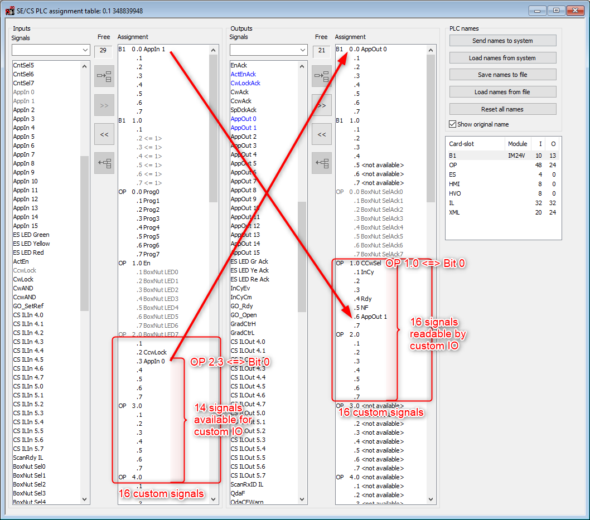

# ST01-button-im24v

This OGS sample project shows how to exchange IO data with a IM24V module plugged
into a CS351 box. OGS uses the MID500/501 and MID0504 to exchange the custom
OpenProtocol IO signals. The first input signal (PLC table OP 2.0) is used to
check the button press state, the first output signal (PLC table OP 2.3) is used
to indicate, that the OGS key-input tool is active.

Here is a screenshot of the PLC assignment table (find the BS350 file here: [BS350-PLC-Assignment-Table-CS351.sio](!BS350-PLC-Assignment-Table-CS351.sio) (use `Edit --> Inserting of` in BS350)):



OGS can write the `OP 2.3 input` bit (left hand side, column inputs) over OpenProtocol,
which will then (by using the `AppIn 0 --> AppOut 0` wire) set the `B1 0.0 output`
(right hand side, outputs). Similar for the input (button connected to `B1 0.0 input`,
left hand side, inputs), which is using the `AppIn 1 --> AppOut 1` wire to connect to
the `OP 1.6 output`. This signal is sent over OpenProtocol back to OGS and used to
detect the input button press.

## Overall setup

The overall setup of this sample can be seen in the `config.lua` file. Basically the
following modules are loaded:

- import_config: Helper module to automatically import the configuration
- barcode, user_manager: default modules for barcode handling and user-rights
- station_io: Custom code to configure the IO and setup OGS interactions

All the sample code is found in `station_io.lua`. Mainly, two things happen in there:

- Implement the `GetOperationResultByKeyInput()` function to handle key input. This
  function is cyclically called by OGS whenever a `key input` tool is active.
- Use the `ToolIOExchange()` function to read and write the custom OpenProtocol IO
  signals. This function is called from the `CyclicPoll()` function, which is registered
  to be called cyclically through `StatePollFunctions.Add()`. Note, that `ToolIOExchange()`
  could also be called from inside `GetOperationResultByKeyInput()`, but it would then be
  executed only when a `key input` tool is active. Calling it from `StatePollFunctions` is
  a more generic solution and can be reused for other purposes (see e. g. [../ST04-kemulti-im24v](../ST04-kemulti-im24v)).

## OpenProtocol parameters

The OpenProtocol custom IO function must be enabled in the `[OPENPROTO]` section in
`[station.ini]` by setting the paramter `EXTERNAL_IO_OFFSET=2`.

Here is the relevant part of the `station.ini` configuration to enable custom OpenProtocol IOs:

``` ini
[OPENPROTO]
; Two bits are used internally by OGS - so set I/O-offset to 2
; this then maps outputs starting from OP2.3 (BMS table)
EXTERNAL_IO_OFFSET=2
```

## Running a test

For a quick test, use any workflow where a `key input` tool is used.
The configuration database contains a sample workflow `T-31`, wehre only a `key input` tool is
defined (start it by entering the model code `T-31` and any 10-digit serial number).
