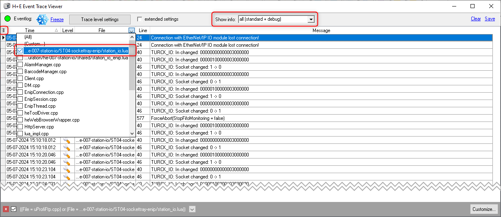

# ST01-sockettray-enip

This OGS sample project shows how to exchange data with the [Turck TBEN-S1-8DXP EtherNet/IP IO](https://www.turck.de/en/product/6814023) remote IO device. The setup
is similar to the sample [../ST01-button-modbus](../ST01-button-modbus), but uses
EtherNet/IP instead of Modbus/TCP and connects the IO to implement a socket tray
function instead of an acknowledge button.

The device type and communication parameters are defined in `station.ini` and some
LUA code is used to map the physical inputs to the socket tray selection for tool #3.
This sample also shows how to add a new EthernNet/IP device to the list of known
devices (see [enip-turck-tben.lua](./enip-turck-tben.lua))

## Overall setup

The overall setup of this sample can be seen in the `config.lua` file. Basically the
following modules are loaded:

- import_config: Helper module to automatically import the configuration
- barcode, user_manager: default modules for barcode handling and user-rights
- station_io: custom code to configure the IO and setup OGS interactions

All the sample code is found in `station_io.lua`. First thing in this file is the line

``` lua
local enip_io = require('station_io_enip')  -- load the EtherNet/IP IO driver
```

Here, the EtherNet/IP LUA driver for OGS is loaded. Whenever this driver is loaded, it
reads the `station.ini`-section `[STATION_IO_ENIP]`. Each line in this section defines
an EtherNet/IP device controlled by OGS (see [EtherNet/IP device communication parameters](#ethernetip-device-communication-parameters)
below for more details). It also defines the type of the device for automatic initialization
and cyclic read/write operation (class 1 cyclic data exchange / assembly access).

As a second step, in the `station_io.lua` file, the driver events are hooked up, so
that changes in the IO device connection state or changes in the IO data can be handled.
The following code from `station_io.lua` connects two functions accordingly:

``` lua
-- connect the driver callback events to our local function handlers
enip_io.OnConnChanged = OnConnChanged
enip_io.OnDataChanged = OnDataChanged
```

The handler functions `OnConnChanged` handles connection state changes - it actually only sends
a message to the trace log (and resets the input values to a default state). `OnDataChanged`
decodes the input value (extract the port 1 connected IO-Link device input bits) and stores
it in a module-local variable (`M.data.in_bits`).

As a third step, the IO data read from the modbus device is handed over to OGS - whenever
OGS waits socket tray information. Whenever OGS needs socket tray information, it calls the
following functions:

- `SetLuaSocket(group, socket)`: Called once, when a tool is started, which requires
  a correct socket to be selected. Parameters include the socket group and the socket
  number (as configured in the configuration database for the current operation)
- `GetLuaSocket(group)`: Called cylically by OGS to ask the LUA code for the currently
  selected socket. Returns `< 0` for an unknown group, `= 0` for no socket selected and
  `> 0` the currently selected socket number
- `GetLuaSocketState(group)`: Called from time to time to check the communication state of
  the socket group. See the sample source code for allowed return values.

Note, that the group does not neccessarily map directly to a tool. The actual mapping is
defined in `station.ini` - only groups defined for the LUA driver can be used and the LUA
functions are called only for these. See [Socket tray parameters](#socket-tray-parameters)
below for more information about how the `station.ini` section has to be set up for custom
socket tray LUA handling.

## Socket tray parameters

To enable socket tray handling for LUA, a virual `LUA`-device socket tray must be added in the `[SocketTray]` section of `station.ini`. Instead of an IP-address, the special code `LUA` must be given, see the following sample (NOTE: if using multiple devices, us `IP1`, `IP2`, ... instead of `IP` for a single device setup):

``` ini
[SocketTray]
ENABLED = 1
Groups = 4 | 4 
; Define channels 1,2,4 use tray #1, channel 3 uses tray #2:
Group_to_Channel = 1 2 4 | 3
Map = 1 2 3 4 5 6 7 8
; First socket tray device is a "real" socket tray at 192.168.1.65
IP1=192.168.1.65
PORT1=502
; Second socket tray is a "virtual" tray implemented in LUA
IP2=LUA
```

**NOTE**: Due to the way, the socket tray functionality works in OGS, the sockets
are numbered sequentially. To use the sockets connected over EtherNet/IP, you must
specify spocket number `5` or `6` in the workflow configuration, as sockets 5-8 are
mapped to group #3 and the group #3 is implemented in the custom LUA socket handler.

## EtherNet/IP device communication parameters

The LUA `station_io_modbus` module expects the Modbus/TCP device parameters to
be defined in the `station.ini`-section `[STATION_IO_MODBUS]` as follows:

``` ini
; Ethernet-IP devices in this station
[STATION_IO_ENIP]
; Define the Ethernet/IP devices used in this station as <name>=<ip>,<model>
; Reference a device by <name> later from the station_io_enip.lua file.
; NOTE: include station_io_enip.lua to use this. 
DEBUG=0
TURCK_IO=10.10.2.135,TurckTBEN_S1_8DXP
;IOLINK_MASTER=192.168.1.71,TURCK_AL1324
```

Basically there is only one parameter: defining a new STATION_IO device named `TURCK_IO`
which has the IP address 10.10.2.135 and used the EtherNet/IP device model `TurckTBEN_S1_8DXP`.
Note, that `TurckTBEN_S1_8DXP` is defined in [enip-turck-tben.lua](./enip-turck-tben.lua).

## Adding new EtherNet/IP devices

To setup cyclic data exchange (explicit owner class 1 EtherNet/IP connection) with an
EtherNet/IP device, OGS needs some parameters ("forward open parameters"). These
parameters are defined as a named entries in the global LUA table `ethernet_devices`
(defined in `ethernet_devices.lua` in the `lualib` OGS folder). The data listed here
is what is usually defined in the EDS file shipped with the device.

To add new devices, add a new item to the global `ethernet_devices` table with the
parameters from the EDS file. To use this new device, reference the item name from
the `station.ini` configuration. See [enip-turck-tben.lua](./enip-turck-tben.lua)
for a sample configuration for the [Turck TBEN-S1-8DXP EtherNet/IP IO](https://www.turck.de/en/product/6814023) remote IO device.

## Running a test

For a quick test, use the `T-03` model. The workflow for this model three operations for
tool #3, where operation 1 requires socket #5 and operation 2 requires socket #6.

To test, start the workflow by entering the model code `T-03` and any 10-digit serial number.

To see the IO in action, you can use the `ETW trace viewer` (must be run elevated, i.e. "run as administrator"). Set the "Show Info" dropdown to "all (standard + debug)", enable the "File" column (click the top-left ellipsis button for opening the field chooser). Then click the "File" column header and select the ".../station_io.lua" entry. This will then show the following (report input/socket changes):

