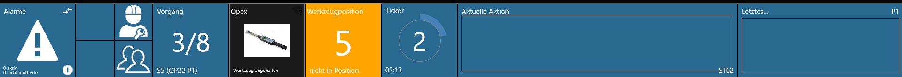
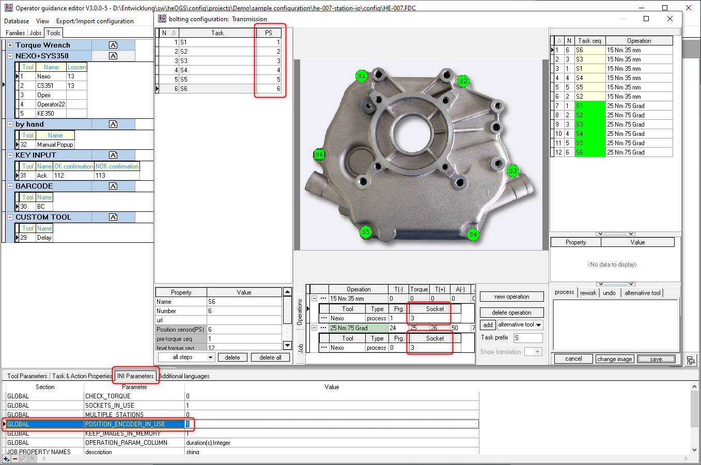
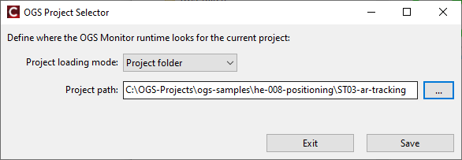

# Sample he-008

This demo project shows different ways on how to use OGS with a positioning system - to
track the position of the tool and/or the workpiece. The idea is to only enable a tool, if
it is in the correct position - to prevent tightening on the wrong bolt and to ensure
reproducible documentation of the tightening results of all bolts.

All documentation (including this file) is formatted in Markdown text. To better read these (*.md)
files, either see them online (at [https://github.com/haller-erne/ogs-samples](https://github.com/haller-erne/ogs-samples)) or use a decent text editor with Markdown support (e.g. the free [Visual Studio Code Editor](https://code.visualstudio.com/Download)).

## Overview

As the underlying idea for positioning is to enable the tool depending on some external
information, this is actually similar to the concept of a socket tray / nut selector
(enable the tool only, if the correct socket was used): both only enable the tool, if the
correct conditions are met. OGS shows the state of "external enable", "socket tray selection"
and "positioning" in the same spot in the OGS runtime GUI - next to the tools tile in the
status bar.

Here is a sample screenshot of the OGS toolbar when the tool is not in the correct position (expected position 5 - yellow background):



As all three conditions might be required, OGS processes the information in a sequence:

1. Check if the correct socket is used (if any)
2. If a correct socket is available (or no check active), check the position
3. If the position is ok, check any additional external signals (external enable)

If any of the preconditions fail, then OGS jumps back in the sequence to the first missing
condition - e.g. if the socket is switched while in the correct position, OGS again shows
the socket request.

Conceptionally, positioning is connected to the bolts position on the part, whereas the socket
information belongs to the tightening operation (i.e. likely the same for all bolts with the
same tightening parameters). OGS therefore uses different spots in the GUI of the workflow editor to configure these parameters (external enable is scripting only):



A task is marked as positioning-enabled by setting the task parameter `Position sensor(PS)` (column `PS` in the jobs editor tasks list) to a non-zero value (to enable the property, set
the `POSITION_ENCODE_IN_USE` in the `GLOBAL`-Section of the `INI Parameters` on the `Tools` tab to `1` - see the bottom part of the screenshot above).
If a tasks `PS`-value is set to zero, then the position is not tracked for the task.

## Samples

This folder provides a number of different samples (configured for the same workflows), which
show different options for integating positioning systems.
To run a specific sample, edit the top-level `config.lua` file (in this folder) and change the project_folder variable to point to the sample subdirectory:



**Please note**: All samples use the same basic configuration and workflows. The **main difference** is the `station_io.lua` file and some related settings in `station.ini`. All 
sample code is in there (except otherwise noted) - feel free to checkout how the different
samples work!

The following samples are available:

- **ST01-digital-io**: Use some digital IOs connected over a Rexroth `R-IL ETH BK DI8 DO4 2TX-PAC` Modbus/TCP remote I/O module to OGS and use the inputs as binary encoded position signals.
  IP-Address and registers are defned in station.ini. This is a very basic sample without 
  teaching or other interactive features.

  Use the model barcode 'S-01' to quickly run a test.

  For details, see [ST01-digital-io/README.md](ST01-digital-io/README.md)

- **ST02-iolink-sensors**: Use a Ethernet/IP connected IO-Link master with a rotary and
  a laser distance sensor to read angle and distance values for a 2D torque support arm
  (like [Jaeger Handling HandyFlex](https://www.jaeger-handling.de/handy-flex?lang=en)).
  The sample shows how to forward position information and translate this into a XY
  coordinate system - including referencing zero and teaching the actual positions from
  the operator screens in the OGS runtime.
  The EtherNet/IP communication settings and the mechanical parameters (like sensor increments
  per rotation) are configured in `station.ini`.

  Use the model barcode 'S-02' to quickly run a test.

  For details, see [ST02-iolink-sensors/README.md](ST02-iolink-sensors/README.md)

- **ST03-ar-tracking**: Use the [AR-Tracking SmartTrack3 realtime tracking system](https://ar-tracking.com/en/product-program/smarttrack3) to track a tools position and orientation in
  3D space. The sample shows advanced positioning features including multi tool tracking,
  angle deviation checking, socket lenght compensation and tolerance objects setup.
  All features (including teaching and realtime position tracking view) are available from
  the operator screens in the OGS runtime.
  
  The SmartTrack camera communication settings and tracker assignment are configured in `station.ini`.

  Use the model barcode 'S-03' to quickly run a test.

  For details, see [ST03-ar-tracking/README.md](ST03-ar-tracking/README.md)

- **more samples**: Please also see samples `he-007` for more details on IO handling.

## Configuration overview

### Automatic configuration import from backup file

All samples share the same configuration database (provided as configuration backup in the file
`./config/he-008.fbc`). The script file `./shared/loadconfig.lua` takes care of checking this
configuration, eventually creating the unpacked `./config/he-008.fdc` configuration database and
`./<active station>/station.fds` file if it is missing. This allows to freely change the configuration
database using the workflow editor `heOpCfg.exe` and to quickly revert to the original settings
(by deleting `./config/he-008.fdc` and/or `./<active station>/station.fds`) - these will be recreated
automatically based on the configuration backup file, when the OGS runtime is started.

NOTE: To generate the configuration database, the OGS runtime (monitor.exe) must be started at least
    once with one of the station configurations!

### Barcodes

The barcode handling setup in `./shared/barcode.lua` used two barcodes:

- Model code: 4-digit alphanumeric code in the form `T-01`, `M-02`, ... The Model code is used to
  lookup a workflow in the database, so you must use one of the codes defined in the database to
  start a workflow (see below for a list of models and workflows define in the database)
- Serial number: 10-digit serial number. Any 10-digit alphanumeric code is accepted here.

### Configured Workflows

The configuration database includes a simple job for each of the configured tools as well as
a more complex workflow for each sample station (subfolder). The corresponding workflow can be
executed by using the model barcode `T-<tool>` (with a 2-digit tool number) or `S-<station>`
(with a 2-digit station number) as follows:

| Model barcode | Tool number | Comment                                               |
| ------------- | ----------- | ----------------------------------------------------- |
|     S-01      |       1     | Tool 1 positioning using I/O                          |
|     S-02      |       1     | Tool 1 positioning using rotational and laser sensors |
|     S-03      |       1     | Tool 1 positioning using ART camera                   |
|     T-01      |       1     | Nexo                                                  |
|     T-02      |       2     | CS351                                                 |
|     T-03      |       3     | OpexPLUS                                              |
|     T-04      |       4     | GWK Operator 22                                       |
|     T-29      |      29     | Delay (LUA tool)                                      |
|     T-30      |      30     | Barcode scan                                          |
|     T-31      |      31     | Keyboard acknowldege (Ok/Nok)                         |
|     T-32      |      32     | Popup acknowledge                                     |

There are a few other Workflows configured (named DEMO-01...DEMO-06 with model codes `M-01`...`M-06`) with some more complex workflows. Look at their definition using the workflow editor!

## Environment setup and running a sample

To setup your environment, follow these steps:

1. Install or update OGS >= V3.0.7 (see [OGS downloads](https://h-e.me/2osih))
2. Eventually apply updates from `./updates`
3. Modify `monitor.lua` (usually at `c:\program files(x86)\Bosch Rexroth AG\OGS V3.0`) to point to `config.lua` in this folder.
4. Modify `config.lua` in this folder to point to the sample you want to run

After the basic setup, make sure to check `station.ini` in the selected sample. See, if the IP addresses of the tools and I/O devices match your environment.

Finally, run the OGS station runtime (monitor.exe).

If you get an error like `cannot find station.fds', then the automatic configuration import
did not work (most likely due to an older version of OGS). The following wokarounds exist:

- upgrade OGS to a more recent version
- manually copy `./config/he-007.fbk` into your sample subdirectory (e.g. `./ST01-button-modbus`)

## Technical details

### Low-level OGS positioning interface

To implement position tracking, OGS provides the following interface functions. If these are implemented, then positioning is available:

``` LUA

-- Check if positioning system reports in position or not. Cyclically called, if a task
-- with positioning enabled is active.
-- Returns:
--   errortext on error
--   true in position
--   false not in position
-- Parameters:
--   Tool: Tool/channel number of active tool
--   JobName, TaskName: Currently active job/task
--   PosCtrl: Position number from the config database (0 = positioning not active)
--   ToolPosDef: Database position data (encoded as a string, see below)
--   TaskState:
--       = 0 - before task start (checking external conditions...)
--       = 1 - after task start (task released)  but tool is still not running (start button 
--             not pressed)
--       = 2 - Tool In Cycle
--   TaskStep:
--       = 0 (reserved)
function PS_CheckToolPosition(Tool, JobName, TaskName, PosCtrl, ToolPosDef, TaskState, TaskStep)
end

-- Check if positioning system reports in position or not. Cyclically called, if a task
-- with positioning enabled is active.
-- Returns:
--   new_state, delta_z, delta_y, delta_x, newToolPosDef, DisplayMsg
-- or
--   nil,       nil,     nil,     nil,     '-',           ErrorMsg
-- If a non-nil new_state is returned, the (string) value in newToolPosDef is stored in
-- the database as the position info of the task. It is up to the LUA code to encode/decode
-- the actual position into/from the string.
--
-- Parameters:
--   State: current teach state 
--          (unknown = 0, teaching active = 1, start teaching = 2, stop teaching = 3)
--   Tool: Tool/channel number of active tool
--   JobName, TaskName: Currently active job/task
--   PosCtrl: Position number from the config database (0 = positioning not active)
--   ToolPosDef: Database position data
function PS_TeachToolPosition(State, Tool, JobName, TaskName, PosCtrl, ToolPosDef)
end

```

### High-level OGS positioning infrastructure

Instead of implementing the raw functions for position tracking, OGS provides a set of
(extensible) drivers. The architecture allows extending the drivers with custom code, e.g.
to implement additional tracking hardware.

To use these drivers, include the `positioning.lua` file (find it in [../shared/positioning.lua](../shared/positioning.lua)) in your project (through the `config.lua` requires list or directly
by adding a `require('positioning)` somewhere in the code').

The `positioning.lua` file automatically scans the `[OPENPROTO]` section for `CHANNEL_XX_POSITIONING=<section>` parameters. If found, then the `<section>` is read. The
section is expected to contain the `DRIVER=` parameter (to select the actual hardware)
driver, as well as the driver-specific parameters for this specific tool. Note, that the
driver itself might need some parameters (in its own section in `station.ini`).

Here is a sample fragment on how to configure a tool with the AR-Tracking driver:

``` ini
[OPENPROTO]
CHANNEL_01=192.168.1.42
CHANNEL_01_TYPE=GWK
CHANNEL_01_PORT=4002
; --> this channel shall use ART positioning
CHANNEL_01_POSITIONING=POSITIONING_ART_CH1

; --> Connection between the CHANNEL_01 and the ART positioning system
[POSITIONING_ART_CH1]
; --> use the ART positioning driver for this channel
DRIVER=ART
; for ART: define the target tracker name/number for this tool as configured in DTrack
TARGET=1

; --> common parameter required by the ART driver
[POSITIONING_ART]
; IP address and port number of the SmartTrack camera:
IP=192.168.1.30
PORT=5000
```

Currently, the following drivers are available:

- `ART`: Driver for the [AR-Tracking SmartTrack3 realtime tracking system](https://ar-tracking.com/en/product-program/smarttrack3), implemented in `./shared/positioning_ART.lua`

- `IO`: Driver for the rotation + distance type systems (like the Jäger HandyFlex) with optional
  support for tilt, implemented in `./shared/positioning_IO.lua`. Note that this driver requires
  calling `UpdatePos_RotIncLenInc()` or `UpdatePos_RotIncLenAbs()` to update the raw position data. The driver then handles coordinate transforms, teaching and tolerance calculations internally.
- `DIGITAL`: Minimal positioning driver, which only uses a single "Inpos" signal (one must call
  the drivers `UpdatePos_InPos()` function). This can be used to connect exisiting positioning
  systems or implement own logic based on digital input combinations.The driver is implemented in `./shared/positioning_DIGITAL.lua`.

The samples in this project show the usage of all of these drivers.

To add a custom driver, use one of the existing drivers as a base and override its functions.
If the LUA module file name adheres to the driver naming convention (module name is `positioning_<drivername>.lua`), then the driver will automatically load, if `DRIVER=<drivername>` is given in `station.ini`.
