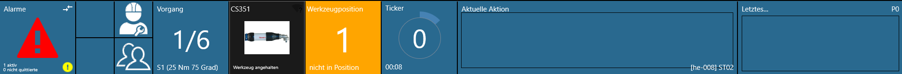
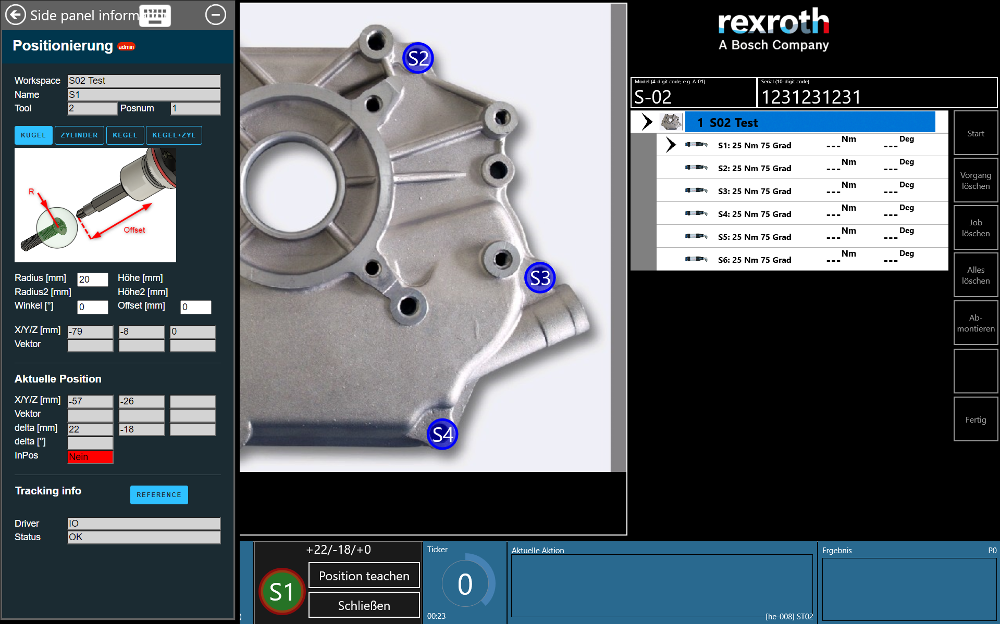

# ST02-ethernetip-sensors

This OGS sample project shows how to use the `positioning_IO` driver for tracking tool
position. This is used in combination with two rotational sensors mounted on a torque
reaction arm (one sensor for arm extension, the other for arm rotation). Both sensors
are connected over EtherNet/IP and the raw data is feed into the LUA driver for 
translating it into a XY coordinate system.

The parameters for the system (like sensor resultions, connectivity parameters) are all
configured in `station.ini`. The actual positions are teached in from the OGS runtime
screens (see below for details).

## Overall setup

The overall setup of this sample can be seen in the `config.lua` file. Basically the
following modules are loaded:

- import_config: Helper module to automatically import the configuration
- barcode, user_manager: default modules for barcode handling and user-rights
- station_io: custom code to configure the IO and setup OGS interactions - note, that
  in station_io, also the `positioning` module is loaded, which is responsible for
  handling tool tracking.

All the sample code is found in `station_io.lua`. First thing in this file is the line

``` lua
local enip_io = require('station_io_enip')  -- load the EtherNet/IP IO driver
```

Here, the EtherNet/IP LUA driver for OGS is loaded. Whenever this driver is loaded, it
reads the `station.ini`-section `[STATION_IO_ENIP]`. Each line in this section defines
an EtherNet/IP device controlled by OGS (see [EtherNet/IP device communication parameters](#ethernetip-device-communication-parameters)
below for more details). It also defines the type of the device for automatic initialization
and cyclic read/write operation (class 1 cyclic data exchange / assembly access).

Then, a few lines below, the positioning driver is loaded:

``` lua
local positioning = require('positioning')  -- positioning driver
```

When loading the `positioning` module, all tools from the `[OPENPROTO]` section in `station.ini` are scanned for a `CHANNEL_<tool>_POSITIONING` parameter - see [../README.md](../README.md) for
more information about setting up positioning in general.

As with other `station_io.lua` modules, in the main section of the file, IO handlers are defined.
The I/O-driver (EtherNet/IP in this case) driver events are hooked up, so that changes in
the IO device connection state or changes in the IO data can be handled.
The following code from `station_io.lua` connects two functions accordingly:

``` lua
-- connect the driver callback events to our local function handlers
enip_io.OnConnChanged = OnConnChanged
enip_io.OnDataChanged = OnDataChanged
```

The handler functions `OnConnChanged` handles connection state changes - it actually only sends
a message to the trace log (and resets the input values to a default state).

The **main** connection between the `positioning` module and the `station_io` data handling
happens in the `OnDataChanged` handler function. This is called, whenever one of the sensors
(extenstion/length sensor or rotational sensor) reports a changed position increment value.
The function decodes the raw sensor value (extract the sensor increment readings) and calls the `positioning.UpdatePos_RotIncLenInc()` function to update the internal position. This function
also handles the coordinate system translation, so OGS can work with XY absolute positions.

### Sidepanel for teaching and referencing

The `positioning.lua` module loaded in `station_io.lua` also registers a `teachin` handler,
which opens the sidepanel with a custom web page for teaching (see `../shared/webroot/positioning.html` for the sidepanel teachin web page implementation).

If the following conditions are met, a click onto the tool icon in the process view status bar
will open the teachin sidepanel:

- The process is halted (press the `stop` button on the righthand interaction buttons)
- The currently selected task has positioning enabled
- The currently logged on user has apropriate rights

## Running a test

For a quick test, use the `S-02` sample workflow (start it by entering the model code `S-02` and any 10-digit serial number).

As all tasks/bolts in this workflow are positioning enabled, so you will likely see a yellow icon for the current positioning state (not in position):



To reference the system or to teach the current position, do the following:

1. Halt the workflow by clicking the `stop` button on the top-right of the operator screen
2. Click the black bordered CS351 tool icon, which will open the teachin side panel. Note, that this will also change the toolbar icons: the tool and the position icons will be replaced by the positioning panel with the actual distance view (XYZ in millimeters) and two buttons to accept the current position (`Teach position`) and stop teaching (`close`).

    

3. To reference the system, move the arm to the mechanical zero position, then click the blue `REFERENCE` button. To teach a position, setup the tolerance parameters in the sidepanel, move the tool to the expected position and click the `Teach position` button in the bottom status
bar. You can watch the position and distance in realtime in the sidepanel and the bottom status
bar.
4. After teaching a bolt, you can select another bolt in the list of tasks (in the righthand job/task list). You can then repeat teachin for another bolt while staying in the teachin mode
5. If you are done teaching all bolts, click the `close` button in the bottom status bar to end teachin mode.

