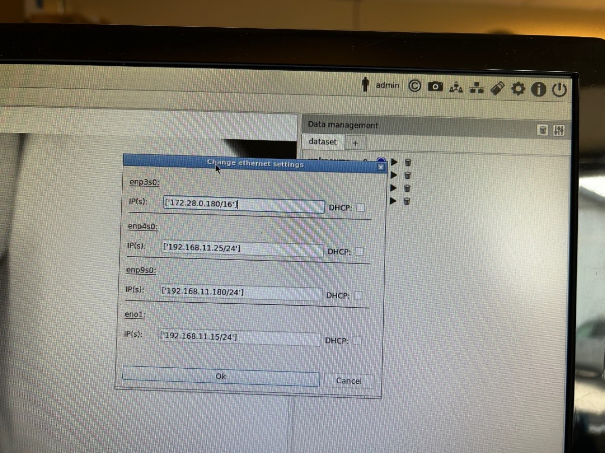

# ST04-ar-verpose

This OGS sample project shows how to use the `positioning_DIGITAL` driver for
tracking tool position in combination with the [AR-Tracking Verpose AI based camera tracking system](https://ar-tracking.com/en/product-program/verpose). The Verpose provides analyzes the camera view and tries to detect a position by comparing the actual camera picture with a
previously leaned camera view. The system is actually an AI model trained to detect features (bolts) on a part and provide the feature name to OGS. OGS then matches this against the configured OGS bolts.

The interface between OGS and Verpose is Modbus/TCP. OGS provides a Modbus server device, the
Verpose system acts as a Modbus Master. Therefore the communication settings are defined on the
Verpose end - it reaches out to OGS to provide data.

Please note, that teching the positions must be handled through the ART Verpose system.  

## Verpose configuration

To connect verpose to OGS, the Verpose system must be configured accordingly.

### Setup Verpose Ethernet interface




## Overall setup

The overall setup of this sample can be seen in the `config.lua` file. Basically the
following modules are loaded:

- import_config: Helper module to automatically import the configuration
- barcode, user_manager: default modules for barcode handling and user-rights
- station_io: Custom code to configure the IO and setup OGS interactions

All the sample code is found in `station_io.lua`. First thing in this file is the line

``` lua
local mb_server = require('luamodbus')  -- load the modbus IO server
```

Here, the Modbus/TCP LUA driver for OGS is loaded. Whenever this driver is loaded, it
reads the `station.ini`-section `[STATION_IO_MODBUS]`. Each line in this section defines
a Modbus/TCP device controlled by OGS (see [Modbus/TCP device communication parameters](#modbustcp-device-communication-parameters) below for more details). It also defines a scanlist of
Modbus registers for automatic initialization and cyclic read/write operation.

As a second step, in the `station_io.lua` file, the driver events are hooked up, so
that changes in the IO device connection state or changes in the IO data can be handled.
The following code from `station_io.lua` connects two functions accordingly:

``` lua
-- connect the driver callback events to our local function handlers
mb_io.OnConnChanged = OnConnChanged
mb_io.OnDataChanged = OnDataChanged
```

The handler functions `OnConnChanged` handles connection state changes - it actually only sends a message to the trace log. `OnDataChanged` decodes the input 1 value (bit 0 of the
modbus register read) and stores it in a module-local variable (`M.data.in_bit0`).

As a third step, the IO data read from the modbus device is handed over to OGS - whenever
OGS waits for a key press (i.e. when the key-input tool is active). While the OGS key-input
tool is active, the LUA function `GetOperationResultByKeyInput()` is called. Depending on
the return value, OGS records no key press, an OK button key press or a NOK button key press.

The function implementation for `GetOperationResultByKeyInput()` in `station_io.lua` actually
only checks the state of the Modbus input by looking at the module-local variable `M.data.in_bit0` (which is set whenever the IO changes and the funtion `OnDataChanged` is called, see
above). The function adds a bit more logic to make it reliably work - it does not look at
the signal state alone, it checks for a rising edge on the input instead.

## Modbus/TCP device communication parameters

The LUA `station_io_modbus` module expects the Modbus/TCP device parameters to
be defined in the `station.ini`-section `[STATION_IO_MODBUS]` as follows:

``` ini
; Modbus-IO devices in this station
[STATION_IO_MODBUS]
; Define the Modbus/TCP/UDP devices used in this station as <name>=<ip>[,<params>]
; Reference a device by <name> later from the station_io_modbus.lua LUA module.
; Each <name> requires an additional section [<name>] in station.ini to define
; the actual scan list (and an initial register write, if needed).
; NOTE: do a `local io = require('station_io_modbus')` to use this module.
REXROTH_ETH_BK=10.10.2.153
; add more devices...
;REXROTH_ETH_BK2=10.28.39.53
; Set debug to enable more verbose logging for ETWTraceViewer
DEBUG=127
```

For each device listed in `[STATION_IO_MODBUS]`, a section with the same name as the
device name is required in `station.ini` to define the register scan list.

Here is a sample:

``` ini
[REXROTH_ETH_BK]   
; Enable outputs (initial write)
INI_REG=[ { "adr": 2006, "val": [ 6 ] } ]
; mein Modul kann kein FC23, also seperate read/writes
MODE=0
; cyclic exchange:
; Jeweils 16 Bit E/A, also jeweis 1 Register
; ACHTUNG: "Register" 1010 (41010) liegt auf "Adresse" 1009!
WR_REG=[ { "adr": 8001, "len": 1 } ]
RD_REG=[ { "adr": 8000, "len": 1 } ]
```

Basically there are the following parameters:

- MODE: 1 = use FC23 read/write, 0 = use seperate read/write calles
- INI_REG: initial register write. The registers and values given are written whenever
  communication is successfully established. Some devices (like the Rexroth IO-block)
  requires this to reset any faults before outout can be enabled.
- WR_REG, RD_REG: defines a list if registers to be read and written for cyclic data
  exchange.

The parameter format for INI_REG, WR_REG and RD_REG are JSON formatted arrays. The item
parameters are:

- adr: Modbus input/holding register address for read or write
- len: Number of 16-bit registers to read or write
- val: Array of 16-bit numbers for the initial register write

## Running a test

For a quick test, use any workflow where a `key input` tool is used.
The configuration database contains a sample workflow `T-31`, wehre only a `key input` tool is
defined (start it by entering the model code `T-31` and any 10-digit serial number).
